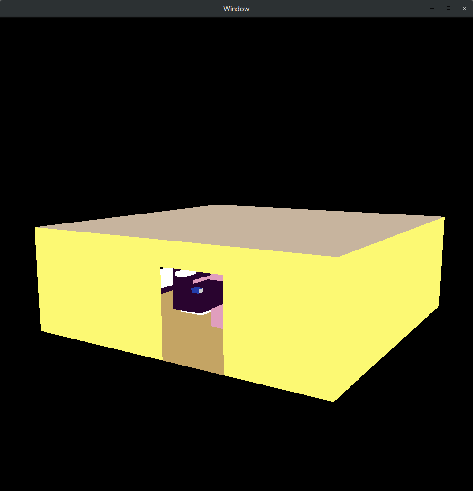
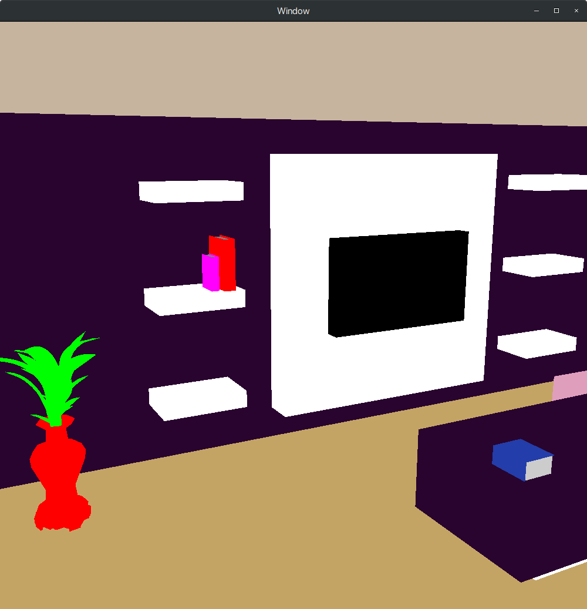
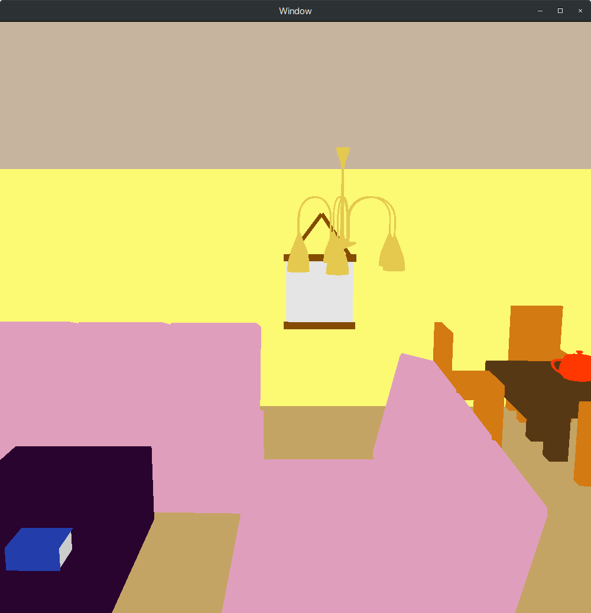
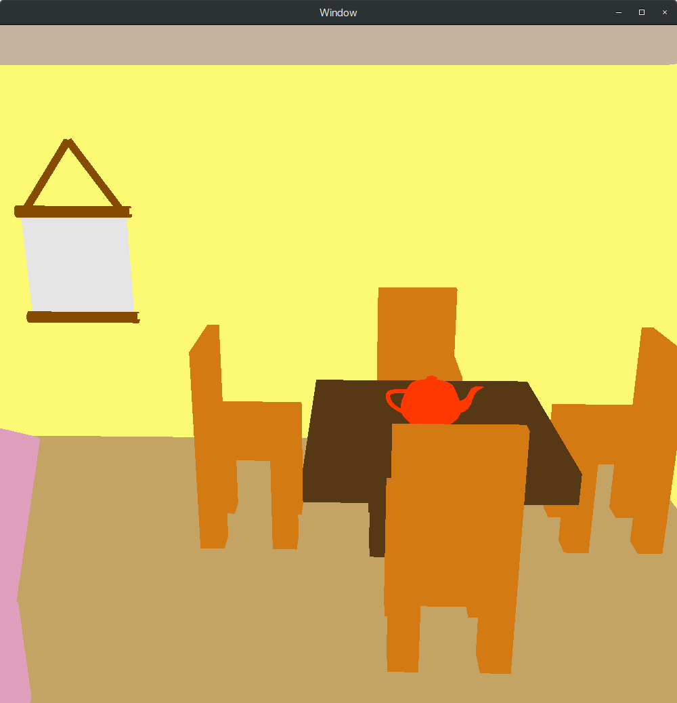
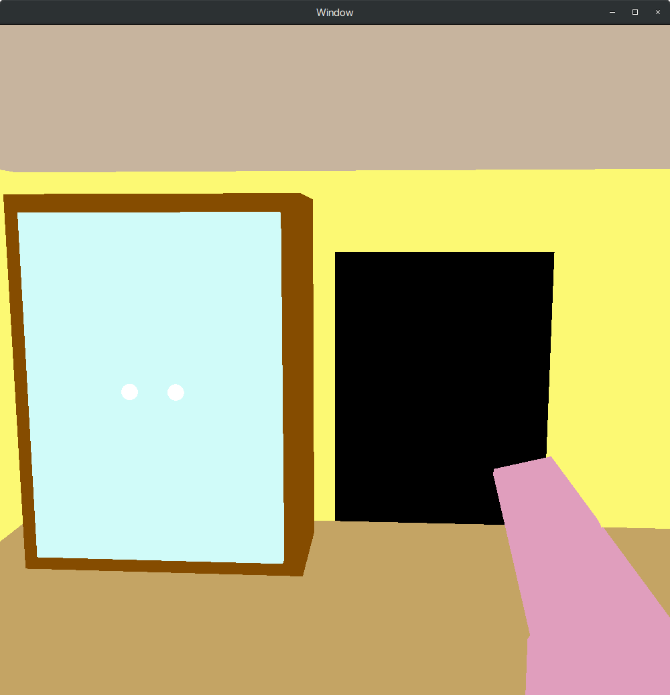
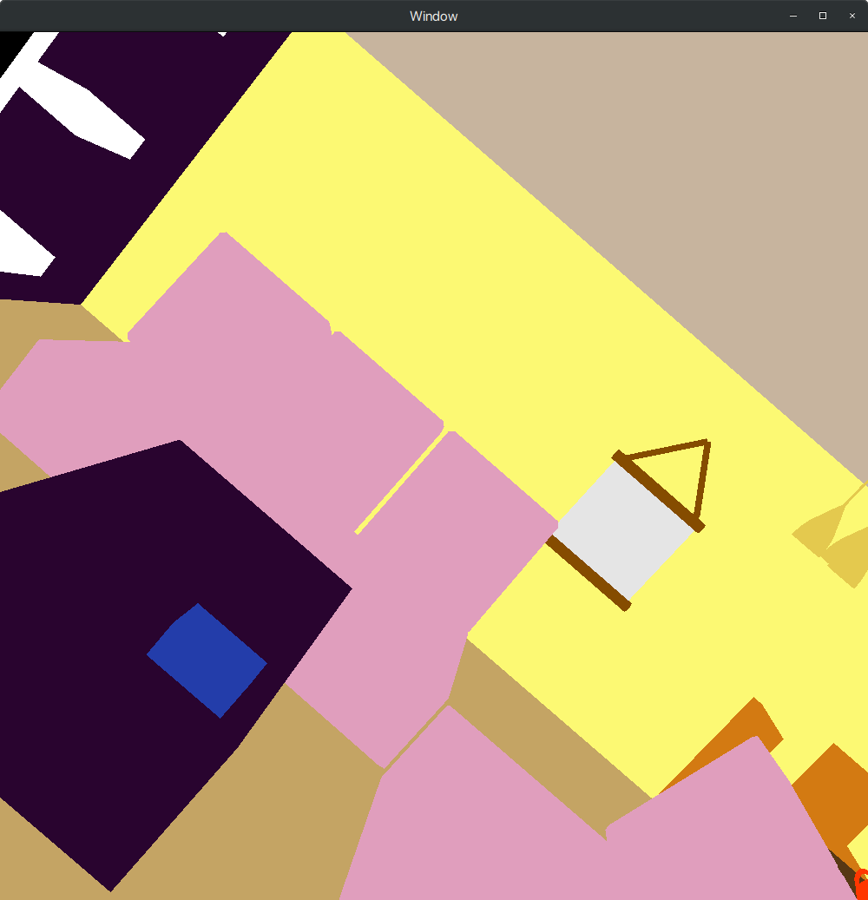

# 3D Scene

The objective of this project is to:
- Render a composite 3D scene formed of various primitives and modeled objects using OpenGL. C++ language is used.
- Implement a camera: this will be used to maneuver around in the 3D scene; functionalities implemented include: moving parallel to each principal coordinate axis and rotation functions: <b>yaw</b>, <b>pitch</b>, and <b>roll</b>.
- Develop API to read and render standard 3D image formats (.obj for this application).

The 3D scene chosen is a rendition of a drawing room. Objects such as a TV, chairs, a tapestry and a chandeilier, etc. have been included. Their specifications can be found in `obj/`.

The following analyses are done on an 8GB memory system powered by Intel Core i7-8550U CPU running Ubuntu 18.04.

# Usage

1. Clone the repository locally.
2. Change the current working directory to the repository.
3. Run the following commands:
   ```shell
   $ make main
   $ ./main
   ```

#### Key bindings

Key|Function
---|------
A|Move left
D|Move right
W|Move up
S|Move down
Z|Zoom in
X|Zoom out
UP ARROW|Move forward
DOWN ARROW|Move back
LEFT ARROW|Roll left
RIGHT ARROW|Roll right

#### Mouse controls

Action|Function
------|--------
Drag right|Yaw right
Drag left|Yaw left
Drag up|Pitch up
Drag down|Pitch down
Right click|Reset camera and orientation

# Demonstration

From Outside</img>|TV set
--|--

Sofa</img>|Dining 
--|--

Cupboard</img>|Rolled View 
--|--

# Notes

- Legacy OpenGL is used for this project. GLUT windowing toolkit is used because of its easy to use API's for rendering purposes and handling user input. This way the focus of the project remains on the graphics part and not on handling complicated API's effectively.
- An `Object` class is implemented. API's provided are `draw()` and `load(char*)`. `load` is used to load a .obj file into memory. This uses an instance of `Parser` (which is also implemented on own) to obtain specifications of vertex coordinates and faces from the 3D model file. `draw` is used to render the loaded face specifications as polygons on the screen.
- For rendering purposes, throughout, matrix stack operations are used to exploit composite transformations.
- The .obj files are either obtained from open sources on the internet or made on own using Blender.
- Analysis using the command `$ /usr/bin/time -v ./main` revealed that maximum memory used by the application when all objects are loaded is `41,656 kB`.  