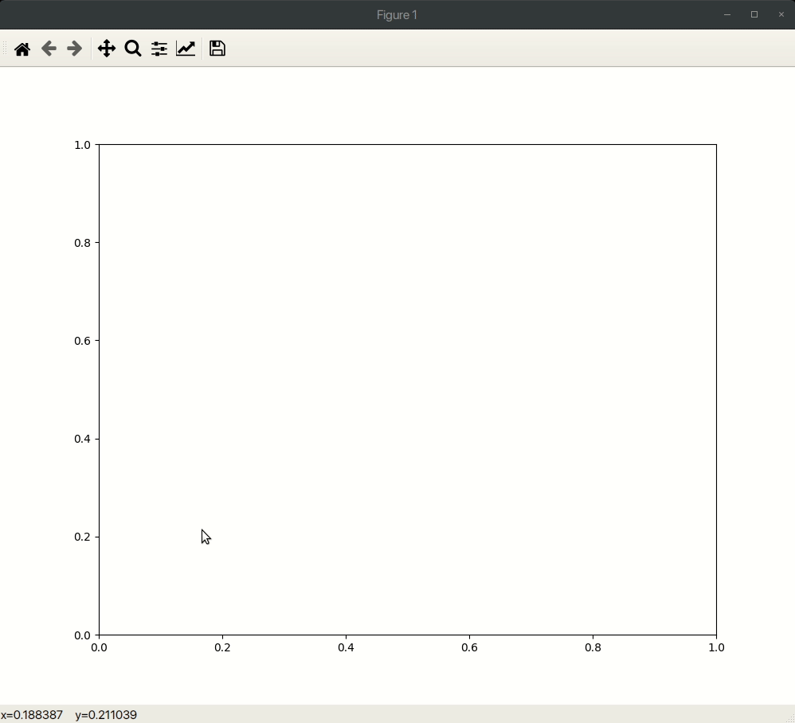

# Curve Drawing

The objective of this project is to:
- Implement de Castlejau's algorithm for computation of Bezier curves.
- Develop an application that interactively allows the user to draw a curve (using above algorithm as backend):
    -- Every time the user clicks on the canvas, a new point will be created and a new Bezier curve of appropriate degree will be drawn.
    -- Existing points can be deleted.
    -- Existing points can be dragged around.

## Usage

1. Clone the repository locally.
2. Change the current working directory to the repository.
3. Run the following command:
   ```shell
   $ python3 main.py
   ```
Note: Requirements to run the application: `Python 3` and the following Python packages: `matplotlib`, `numpy`.

#### To insert a point
- Hover over the pointer to the location at which point has to be added.
- Click left mouse button.

#### To delete a point
- Press X.
- Hover over the point that has to be deleted. It will get a red highlight.
- Click left mouse button.
- Press X again if delete mode has to be turned off.

#### To move a point
- Press M.
- Hover over the point that has to be moved. It will get a green highlight.
- Click left mouse button.
- Drag pointer to wherever mouse has to be placed; the point will be dragged along.
- Click left mouse button with pointer at appropriate location.
- Move mode will turn off with this.


#### Key bindings

Key|Function
---|------
X|Toggle delete point state
M|Toggle move point state

## Demonstration

</img>