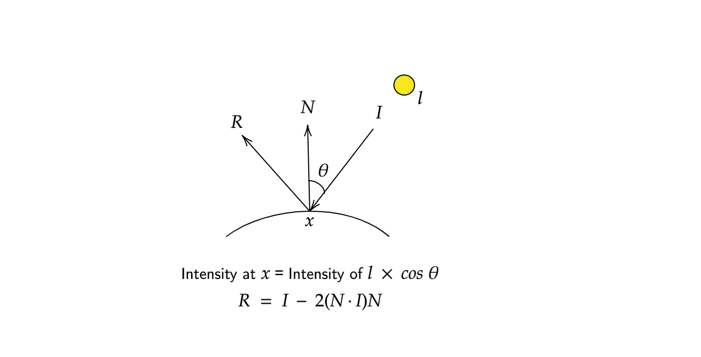

# Ray Tracing

The objective of this project is to implement a simple ray tracer. This implementation uses `C++` and `C++ STL` and no other libraries. The following experiments are done on an 8GB memory system powered by Intel Core i7-8550U CPU running Ubuntu 18.04.

### Usage

1. Clone the repository locally.
2. Change the current working directory to the repository.
3. Run the following commands:
   ```shell
   $ make main
   $ ./main
   ```
4. Image will be stored as `rendered.bmp` and can be viewed using any image viewer capable of reading bitmap files.

### Features of the implementation

- `Image` class - Bitmap image writer: to create bitmap files from color channel arrays
- `Vector3` class - library to support 3D vector functions
- `Color` class - library to support RGB and HSV color spaces and their interconversion
- `Camera` class - to simulate a camera (shoot rays into the scene and capture images on screen)
- `Scene` class - to simulate rendering (reflections, shadows)
- `Ray` class - to support simulation of a ray
- `Light` class - to simulate a light source (extended by `LightPoint`)
- `Object` class - to simulate objects in the scene; get their normals, test for intersection with rays, etc. (extended by `Sphere` and `Plane`)

### Algorithm

</img>


### Results

|No Ray Tracing|Ray Tracing With Lights|
|--|--|
|</img>|</img>|

|Ray Tracing With Lights & Shadows|Ray Tracing With Lights, Shadows & Reflections|
|--|--|
|</img>|</img>|

- There is a white colored floor in the image.
- Various spheres are rendered with varying degrees of reflectivity. For ex. leftmost red sphere has zero reflectivity and second sphere from right has almost 100% reflectivity (almost like a perfect mirror).
- There are two light sources in the scene and details about their location can be inferred from the ways shadows are cast in the scene.
- In a summary, it can be said that ray tracing makes the pictures look **photorealistic**.
- Output of `$ \usr\bin\time -v ./main` :
    ```
    User time (seconds): 5.68
    Maximum resident size (kbytes): 10372
    ```

</img>


### Implementation Details

##### Color and Image
- `Color` class stores the representation of a color in RGB and HSV spaces. Color in either `unsinged byte` format or `double` format can be used to instantiate a `Color` instance. Instantiation in either space calls for automatic computation of equivalent color in the other space. So, the color can be retrieved in either formats.

- `Image` provides an interface to store the channel information that is required to store an image. It provides an API to set the color value of a pixel in the image. Finally, it performs the functionality to take these channels and output a `bitmap` image while taking care of necessary headers etc.

##### Vector3
- It is a utilities library to support all vector operations and operator overloading that may be necessary to work with vectors.
- Static functions to compute dot and cross products are also implemented.

##### Camera and Ray
- `Camera` class simulates a screen onto which the screen coordinates are defined using `alpha` and `beta` coordinates. The screen coordinates are converted to world coordinates and a Ray is casted from the position of the Camera into the `Scene` through the pixel on the screen. The color of the pixel will be whatever color the Ray returns with.
- `Ray` class is used to encapsulate the properties of a ray in real world: `src`, `dest`, and `direction`.

##### Light
- `LightBase` class simulates a light source; it has its own `position`, `color` and `intensity` which are used during ray tracing.
- `LightBase` is designed to be a generic class from which various kinds of light sources inherit. Currently, only `LightPoint` extends the base class.

##### Object
- `ObjectBase` encapsulates all the functionalities of an `Object` in a `Scene`. It has properties of color and reflectivity. It also provides API's to test whether a `Ray` intersects the `Object`. This function then returns information about this intersection point of intersection, color at the point, normal at the point, distance of the point from origin of the ray.

- `ObjectBase` is designed to be a generic class from which various kinds of objects inherit. Specifically, the inherting classes need to implement these API's. In order to do so, they must come up with their own ways of calculating normals and testing for intersections with themselves. `Sphere` and `Plane` classes inherit from `Object`.

##### Scene
- `Scene` class puts together all the pieces and simulates the process of ray tracing using its `render` API.
- It casts a ray into the scene for each pixel and before setting the color of the ray for the pixel, it tests whether in the line of sight from the intersection point to a light source if there was any other object - if there was, this point should be in a shadow.
- It also simulates reflection at a point by recursively calculating the color of the reflected ray from the point of interest - a recursion depth limit is set for this to capture photorealism.

### Math Details
</img>