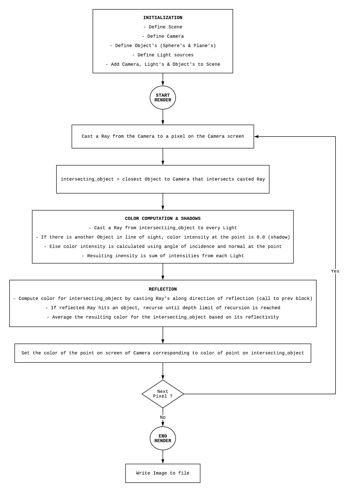

# Ray Tracing

The objective of this project is to implement a simple ray tracer.

#### Features of the implementation

- `Image` class - Bitmap image writer: to create bitmap files from color channel arrays
- `Vector3` class - library to support 3D vector functions
- `Color` class - library to support RGB and HSV color spaces and their interconversion
- `Camera` class - to simulate a camera (shoot rays into the scene and capture images on screen)
- `Scene` class - to simulate rendering (reflections, shadows)
- `Ray` class - to support simulation of a ray
- `Light` class - to simulate a light source (extended by `LightPoint`)
- `Object` class - to simulate objects in the scene; get their normals, test for intersection with rays, etc. (extended by `Sphere` and `Plane`)

### Algorithm

</img>

### Results

</img>

- There is a white colored floor in the image.
- Various spheres are rendered with varying degrees of reflectivity. For ex. leftmost red sphere has zero reflectivity and second sphere from right has almost 100% reflectivity (almost like a perfect mirror).
- There are two light sources in the scene and details about their location can be inferred from the ways shadows are cast in the scene.
- In a summary, it can be said that ray tracing makes the pictures look **photorealistic**.