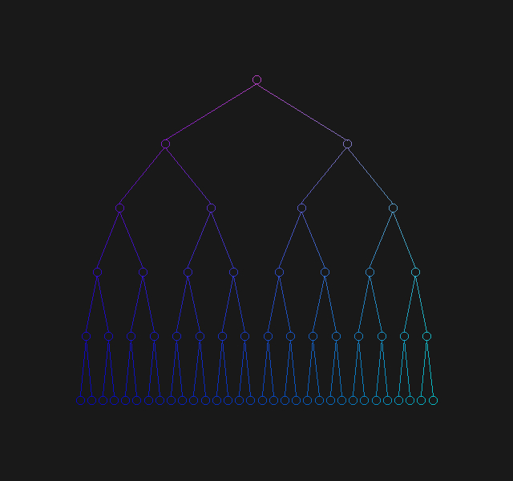
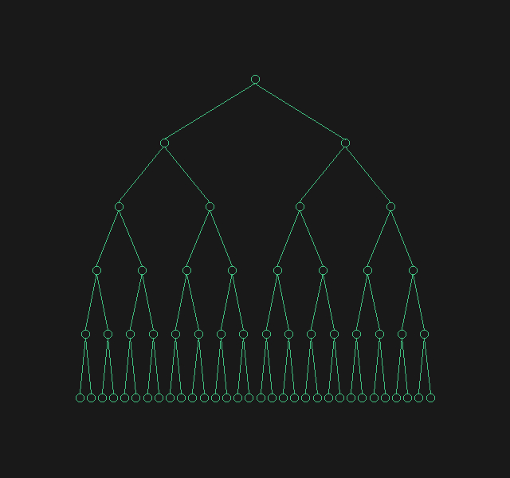
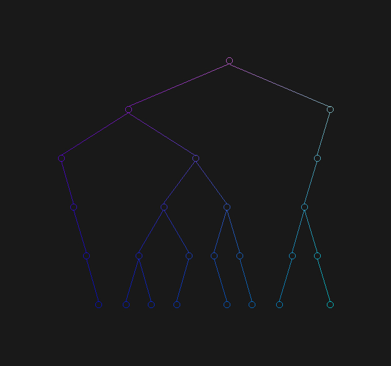
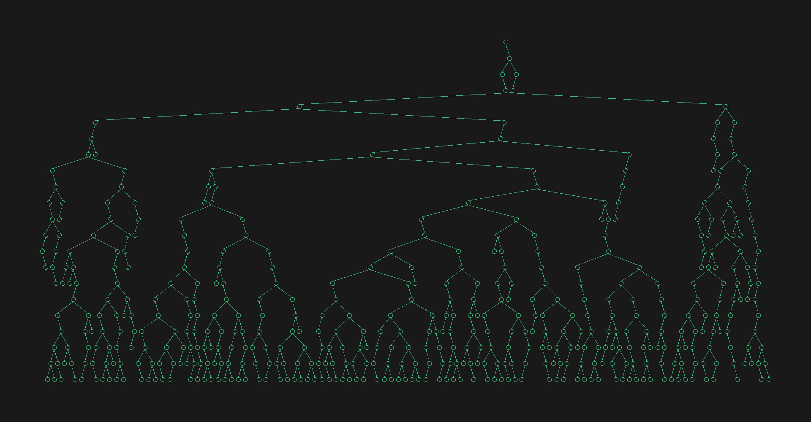

# Tidier Drawings of Trees

The objective of this project is to implement:
<b>E. M. Reingold and J. S. Tilford. 1981. Tidier Drawings of Trees. IEEE Trans. Softw. Eng. 7, 2 (March 1981), 223–228. </b>

The algorithm talks about an optimal tree drawing algorithm that takes into account four important aesthetics including symmetry of subtrees. The algorithm produces pleasing tree outputs. On a screen of $1920 \times 1080$, a depth of $22$ was achieved for a randomly spaced tree. However, only a depth of $7$ was achieved for complete binary trees.

OpenGL 4.5 (Core Profile) Mesa 19.2.8 (with C++) is used to render the trees after the output was obtained from the algorithm described above. The windowing toolkit used is GLFW3.

The following analyses and measurements are done on an <i>8GB</i> memory system powered by <i>Intel Core i7-8550U CPU</i> and <i>Intel UHD Graphics 620 GPU </i>running <i>Ubuntu 18.04</i>.

## Usage

1. Ensure that the above mentioned libraries are correctly installed.
2. Clone the repository locally and change current working directory to the repository.
3. Run the following commands:

    `$ make main`

    `$ ./main`

4. Follow on-screen instructions.

<i> Note: When making random trees, it is possible that the tree rendered will not be very interesting (only one node etc.) in which case, run the program again.</i>

### Some outputs

<i> These images are best viewed in a zoomed in format in a separate window.</i>

Creative coloring|Monochromatic coloring
-----------------|----------------------
|

Random tree|
:----------:|
|

Bigger trees|
:----------:|
|

## Analysis of code
The execution time here is the time taken to:
   1. Generate the complete tree using generator
   2. Run the algorithm described in paper
   3. Get lines and circles for edges and nodes

Depth of tree  (0 indexed) | Number of nodes | Execution time
--- | --- | ---
2 |7|0.008s
3 |15|0.004s
7 |255|0.074s
8 |511|0.137s
9 |1023|0.258s
10 |2047|0.461s
11 |4095|0.915s
12 |8191|1.768s
13 |16383 |3.446s

For random trees

Depth of tree  (0 indexed) | Number of nodes | Execution time
--- | --- | ---
15 |312|0.06s
20 |1046|0.35s
23 |1345|2.00s
